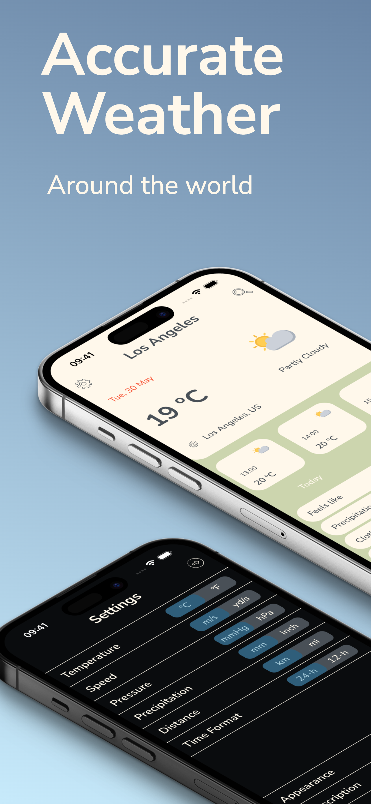
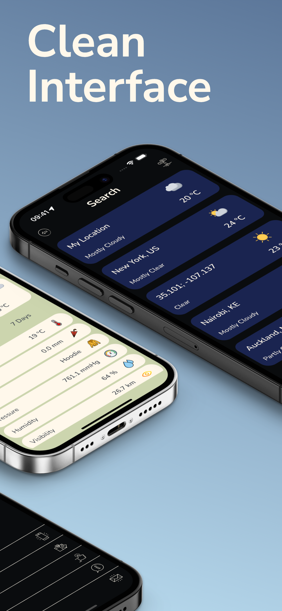
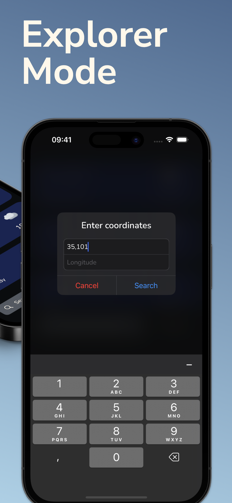
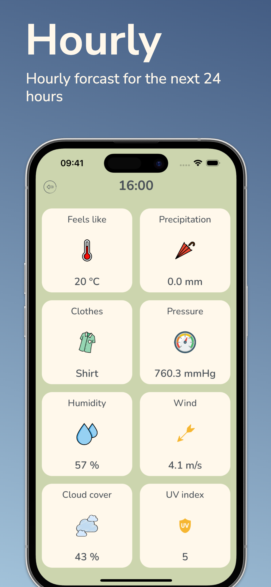
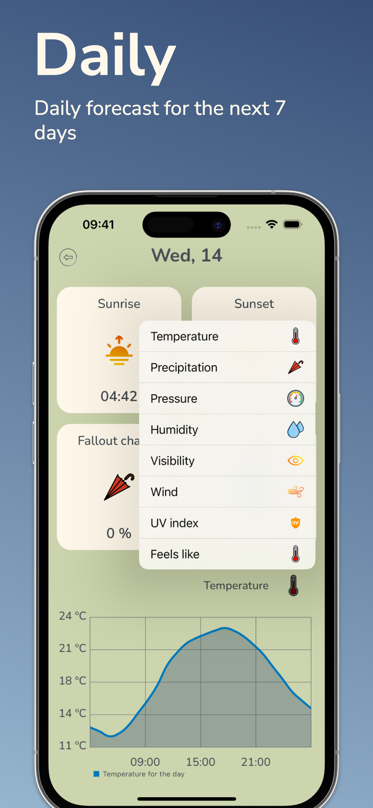

# Sunny: Weather Forecast
Sunny - my final project (weather app) in the iOS Development course in TeachMeSkills school. 
This is a copy of my project.

AppStore: https://apple.co/43Sht1T

## Stack
- Swift
- UIKit
- Alamofire
- Charts
- SwipeCellKit
- Realm
- RevenueCat
- SPIndicator

## API
- WeatherKit REST API
- OpenWeather REST API

## External Libraries
- Alamofire
- SwipeCellKit
- SPIndicator
- Charts
- Firebase Crashlytics

## Compatibility
- iPhone 
Requires iOS 14.0 or later 

## Previews

  
  
  
  
  

